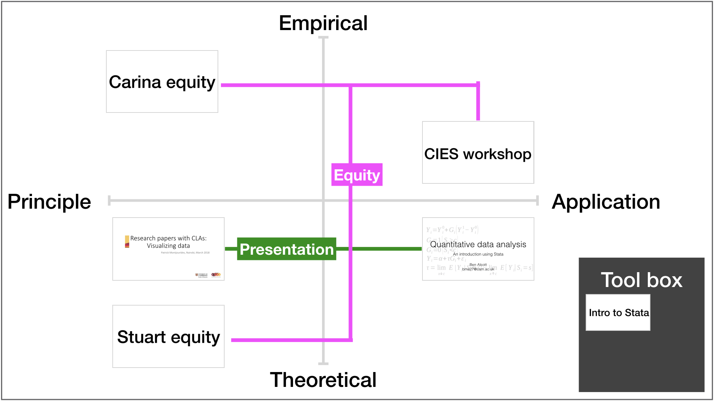

# Conceptual mapping

>Statistics are no substitute for judgment
>
>*Henry Clay*

This site aims to help students develop, and make connections between: 

| Tools						| Ideas          | 
| -------------				|:-------------:  | 
| Principle					| Empirical      | 
| Application      			| Theoretical        |  

An initial mapping of these elements: 

##Presentation
Data visualisation principles

[Data visualisation examples (Stata)] (..Modules/Technique/TD1.pdf)

[Giving an academic presentation (external)](https://http://www.raulpacheco.org/2018/04/10-tips-to-give-a-solid-scholarly-talk-within-a-short-time-frame/ "Raul Pacheco-Vega")

##Equity
Stuart equity

Carina equity

CIES stata workshop