# Data visualisation – an example with Stata

>The idea is to go from numbers to information to understanding
>
>*Hans Rosling*

##Aims
This session aims to give you familiarity with how to:

1. Generate foundational analysis
1. Get analysis into a publishable format (without too much effort)
1. Make graphs that people can (and want to) interpret

All with Stata!

##Tools

| 								|				| 
| -------------				|:---------:	| 
| Do file						| [Link](Do file/D1.do)			| 
| Dataset      				| [Link](Datasets/D1.dta)  		|  

##Content

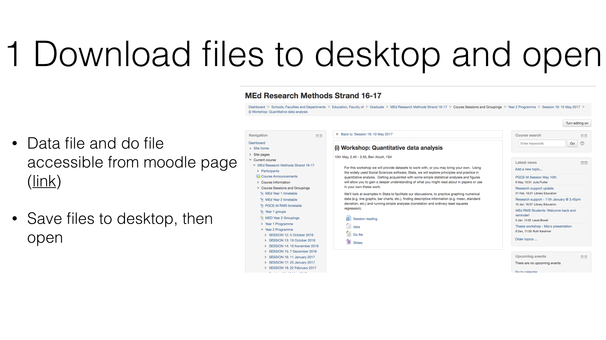
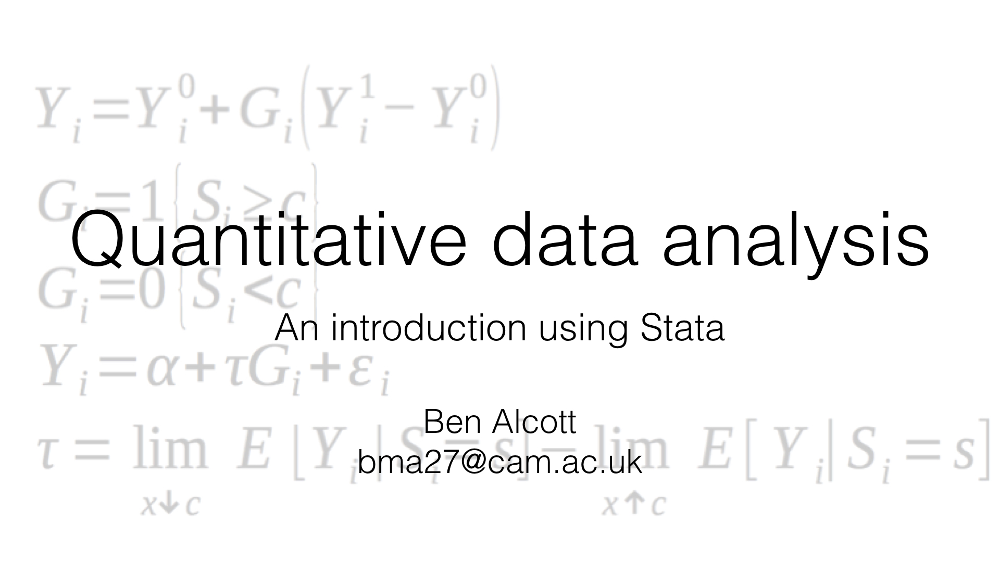
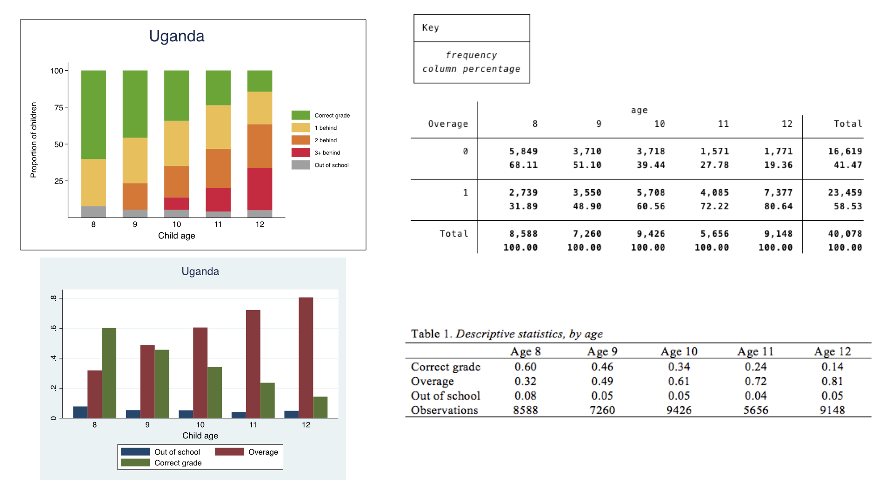
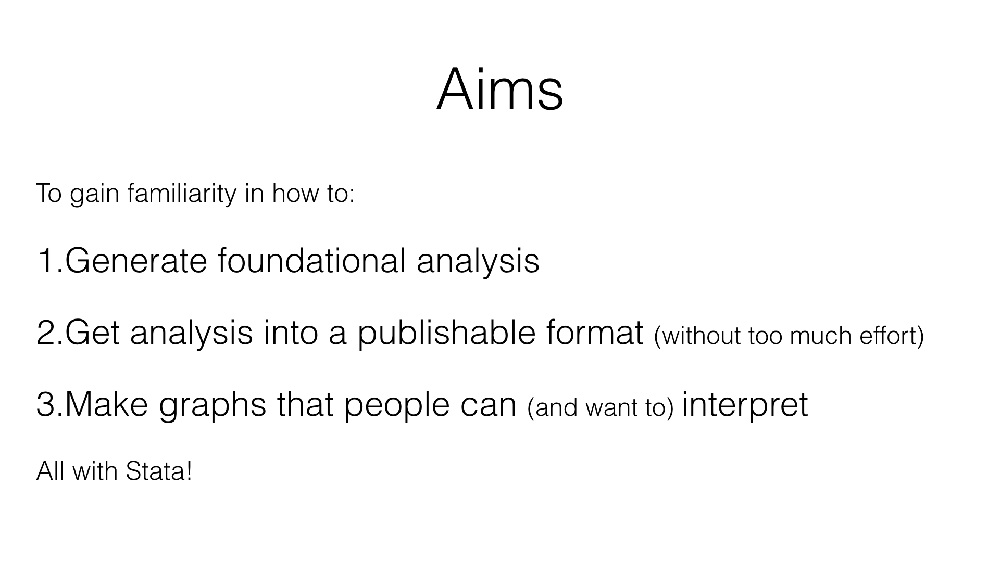
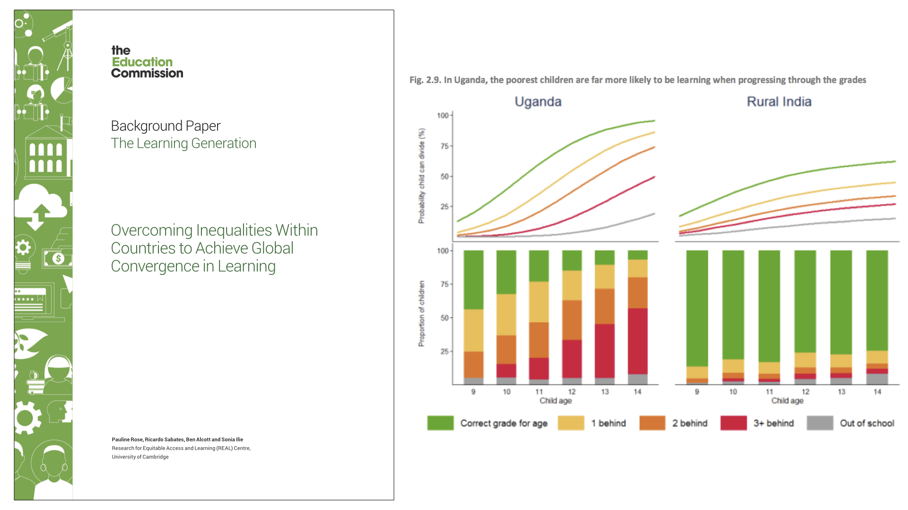

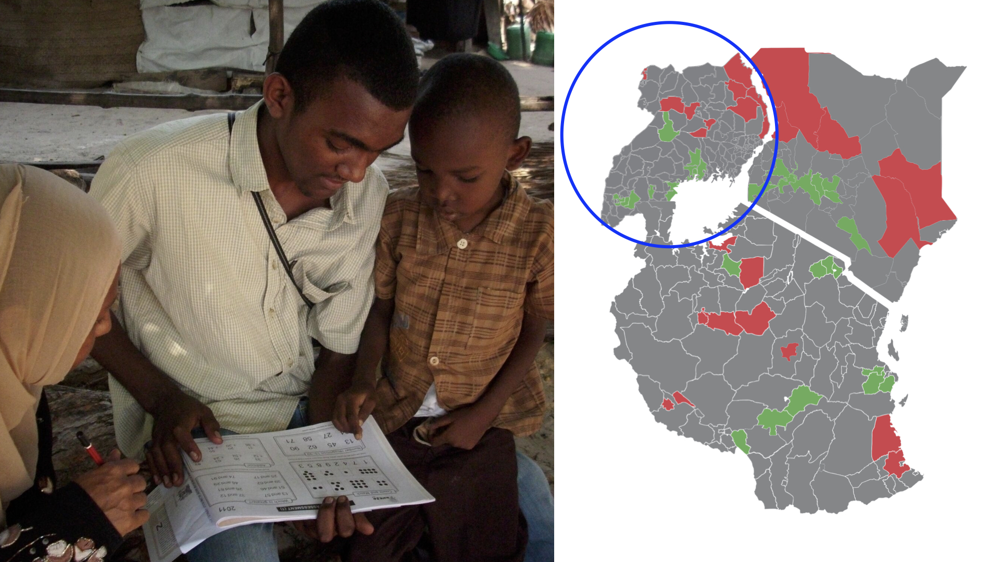
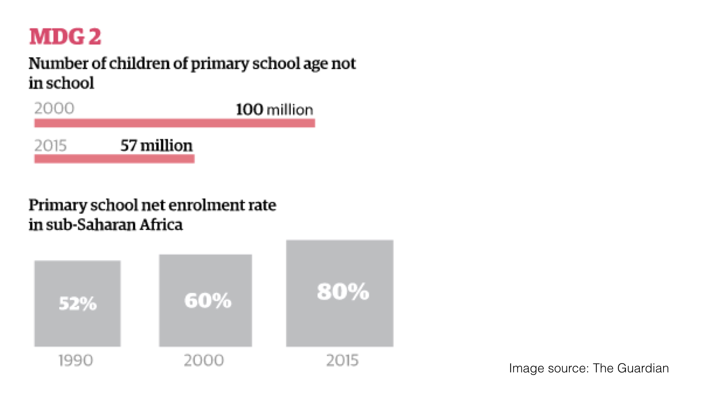
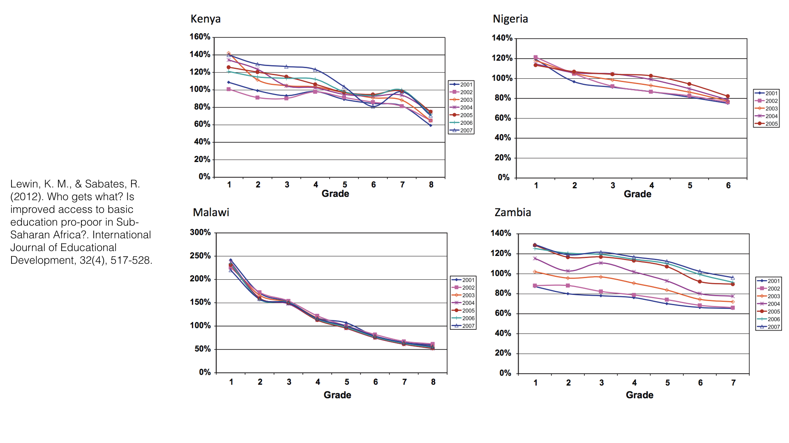

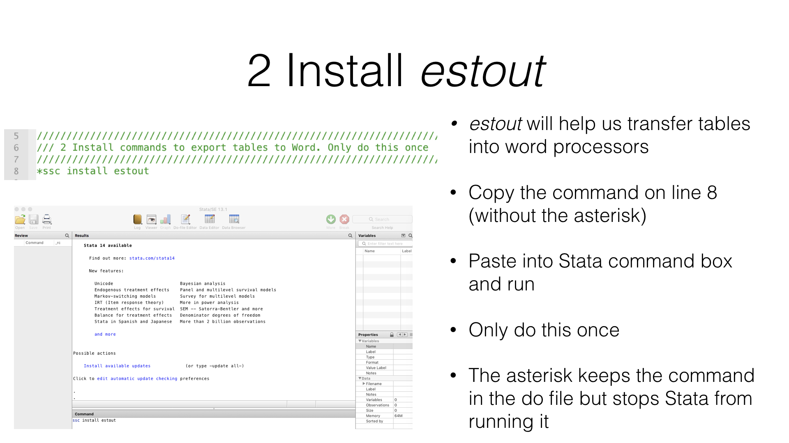
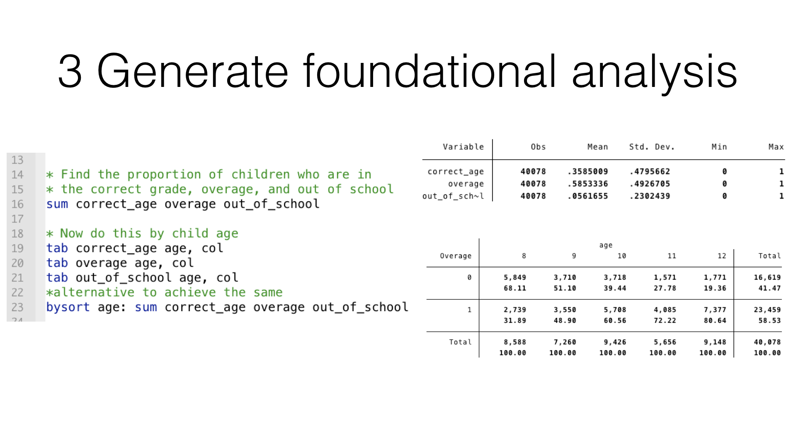
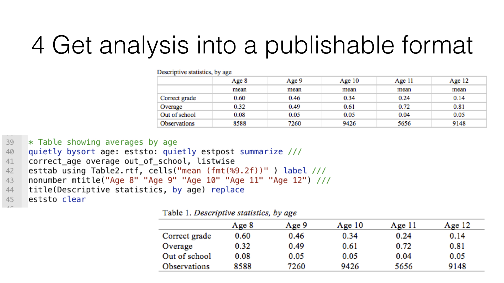
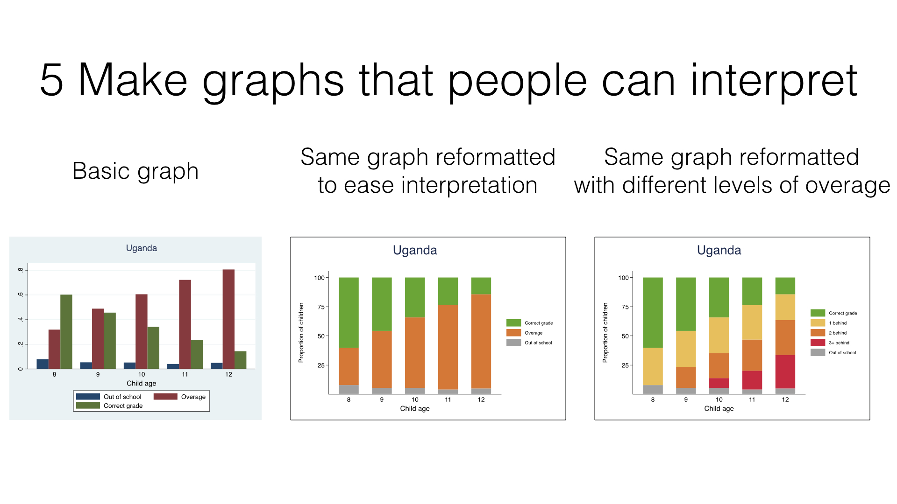

##Related sessions
| Concept						|				| 
| -------------				|:---------:	| 
| Principles of data visualisation		| Link  		|  

| Stata					|				| 
| -------------				|:---------:	| 
| Regression models		| [Link](Modules/Technique/Session R1 (Stata regression example).md)  		|  

##Further reading
[To add!]